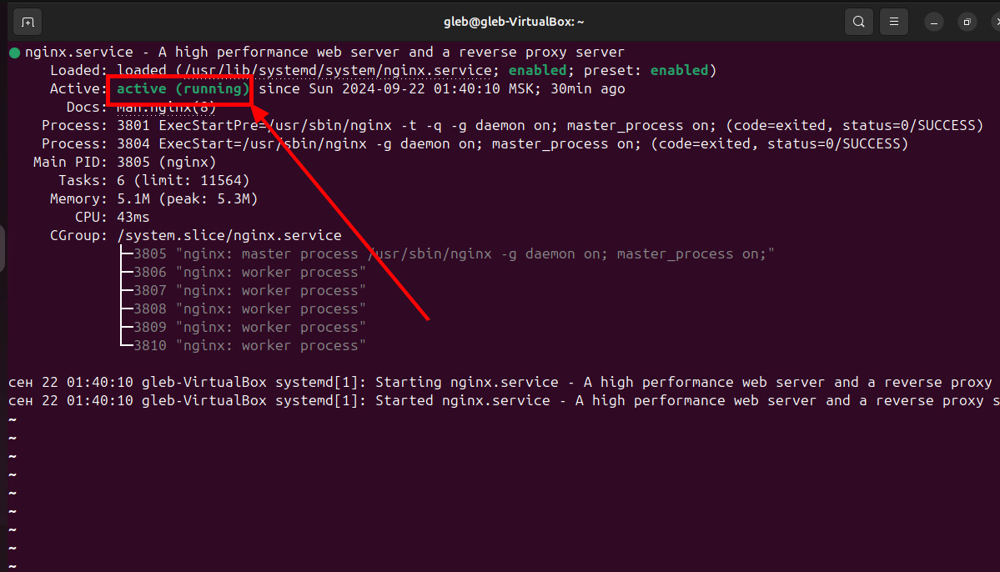

# Лабораторная работа №1 - Настройка Nginx по заданному ТЗ

## <u>1. Установка nginx</u>

Установка Nginx — это простой процесс. Следуйте этим шагам, чтобы установить Nginx на вашу систему (В реалях данного проекта я буду пользоваться ОС от ubuntu):

#### Шаг 1) Обновите список пакетов

Прежде чем установить новое программное обеспечение, рекомендуется обновить список пакетов. Откройте терминал и выполните следующую команду:

```nginx
sudo apt update
```

#### Шаг 2) Установите Nginx

После обновления списка пакетов установите Nginx, выполнив следующую команду:

```nginx
sudo apt install nginx
```

#### Шаг 3) Запустите Nginx

После завершения установки можно запустить Nginx. Выполните следующую команду:

```nginx
sudo systemctl start nginx
```

#### Шаг 4) Проверьте статус Nginx

Чтобы убедиться, что Nginx запущен и работает, проверьте его статус:

```nginx
sudo systemctl status nginx
```

Вы должны увидеть сообщение о том, что Nginx активен и работает (active (running)).



#### Шаг 5) Проверьте установку

Теперь откройте веб-браузер и введите `http://your_server_ip` или `http://localhost`. Вы должны увидеть страницу приветствия Nginx, которая подтверждает, что установка прошла успешно.


#### Шаг 6) Настройка Nginx (опционально)

Основной файл конфигурации Nginx находится по адресу `/etc/nginx/nginx.conf`, а файлы для виртуальных хостов (если используются) находятся в каталогах `/etc/nginx/sites-available/` и `/etc/nginx/sites-enabled/`. Вы можете редактировать эти файлы для настройки Nginx под ваши нужды.

#### Шаг 7) Перезапустите Nginx после изменений (если нужно)

После внесения изменений в конфигурацию не забудьте перезапустить Nginx для применения изменений:

```nginx
sudo systemctl restart nginx
```

Теперь вы успешно установили и настроили Nginx!

## 2. Принудительное перенаправление HTTP на HTTPS

Для обеспечения безопасного соединения нужно настраивать перенаправление HTTP (порт 80) на HTTPS (порт 443). Это делается в отдельном блоке `server`:

```nginx
server {
    listen 80 default_server; # Слушает на 80 порту (HTTP) и устанавливает этот сервер как сервер по умолчанию.
    return 301 https://$host$request_uri;  # Перенаправляет все запросы на HTTPS (301 - постоянное перенаправление).
}
```

## 3. Настройка HTTPS с сертификатом

Для работы по HTTPS вам потребуется действующий SSL-сертификат. Вы можете получить сертификат через Let's Encrypt или использовать другой удостоверяющий центр. Лично я использовал openssl по данной команде:

```nginx
openssl req -x509 -nodes -days 365 -newkey rsa:2048 -keyout /usr/share/nginx/keys/key.key -out  /usr/share/nginx/keys/sert.crt
```

После получения сертификата, вам нужно будет указать путь к сертификату и ключу в конфигурации Nginx.

Пример конфигурации для HTTPS:

```nginx
server {
    listen 443 ssl; # Слушает на 443 порту (HTTPS) с использованием SSL.
    server_name loc.project1.com; # Указывает доменное имя, к которому относится этот сервер.

    ssl_certificate /usr/share/nginx/keys/sert.crt; # Путь к SSL-сертификату.
    ssl_certificate_key /usr/share/nginx/keys/key.key; # Путь к приватному ключу SSL-сертификата.

    location / { # Определяет настройку для корневого URL.
        root /var/www/project1.com; # Указывает корневую директорию для файлов сайта.
        index index.html; # Указывает файл, который будет загружаться по умолчанию.
        try_files $uri $uri/ =404; # Проверяет наличие запрашиваемого файла и возвращает 404, если файл не найден.
    }
}
```

По итогу у нас получиться это( адрес не защищен, т.к. у нас не действительный сертификат, но главное что он есть :)):


## 4. Использование alias для создания псевдонимов путей

Вы можете использовать директиву `alias` для создания псевдонимов к файлам или каталогам на сервере. Например, если у вас есть каталог `files` и вы хотите получить доступ к его содержимому по URL `yourdomain.com/files/`, то ваша конфигурация может выглядеть следующим образом:

```nginx
location /mems/ { # Определяет настройку для URL, начинающегося с /mems/.
   alias /var/www/project1.com/mems/; # Указывает, что данный URL соответствует этой директории.
}
```

По итогу у нас получиться это:


## 5. Настройка виртуальных хостов для обслуживания нескольких доменных имен

Чтобы настроить несколько доменных имен на одном сервере, создайте отдельные блоки `server` для каждого домена. Пример конфигурации для двух доменов:

```nginx

# Конфигурация для первого домена

server {
    listen 443 ssl; # Слушает на 443 порту (HTTPS) с использованием SSL.
    server_name loc.project1.com; # Указывает доменное имя, к которому относится этот сервер.

    ssl_certificate /usr/share/nginx/keys/sert.crt; # Путь к SSL-сертификату.
    ssl_certificate_key /usr/share/nginx/keys/key.key; # Путь к приватному ключу SSL-сертификата.

    location / { # Определяет настройку для корневого URL.
        root /var/www/project1.com; # Указывает корневую директорию для файлов сайта.
        index index.html; # Указывает файл, который будет загружаться по умолчанию.
        try_files $uri $uri/ =404; # Проверяет наличие запрашиваемого файла и возвращает 404, если файл не найден.
    }

    location /mems/ { # Определяет настройку для URL, начинающегося с /mems/.
        alias /var/www/project1.com/mems/; # Указывает, что данный URL соответствует этой директории.
    }
}

# Конфигурация для второго домена

server {
    listen 443 ssl; # Слушает на 443 порту (HTTPS) с использованием SSL.
    server_name loc.project2.com; # Указывает доменное имя, к которому относится этот сервер.

    ssl_certificate /usr/share/nginx/keys/sert.crt; # Путь к SSL-сертификату.
    ssl_certificate_key /usr/share/nginx/keys/key.key; # Путь к приватному ключу SSL-сертификата.

    location / { # Определяет настройку для корневого URL.
        root /var/www/project2.com; # Указывает корневую директорию для файлов сайта.
        index index.html; # Указывает файл, который будет загружаться по умолчанию.
        try_files $uri $uri/ =404; # Проверяет наличие запрашиваемого файла и возвращает 404, если файл не найден.
    }
}
```

По итогу у нас выводяться даныестраницы:


## 6. Настройка мониторинга сервера

Чтобы настроить мониторинг в данном коде Nginx, вам нужно добавить блок `location` для статуса сервера. Это будет точка, по которой вы можете просматривать статистику о работе Nginx. Для этого используется директива `stub_status`. В вашей текущей конфигурации должен появиться данный кусок:

```nginx
    location /nginx_status { # Определяет настройку для получения статуса сервера.
        stub_status on; # Включает отображение статистики работы Nginx.
        allow 127.0.0.1; # Разрешает доступ к статусу только с локального хоста.
        deny all; # Запрещает доступ ко всем остальным IP-адресам.
    }
```

Теперь если перейти по данной ссылки: `https://loc.project1.com/nginx_status` можно будет посмотреть как работает Nginx в данный момент.


## Полная конфигурация Nginx

Объединив все вышеописанные настройки, ваш файл конфигурации может выглядеть следующим образом:

```nginx
# Перенаправление HTTP на HTTPS

server {
    listen 80 default_server; # Слушает на 80 порту (HTTP) и устанавливает этот сервер как сервер по умолчанию.
    return 301 https://$host$request_uri;  # Перенаправляет все запросы на HTTPS (301 - постоянное перенаправление).
}

# Конфигурация для первого домена

server {
    listen 443 ssl; # Слушает на 443 порту (HTTPS) с использованием SSL.
    server_name loc.project1.com; # Указывает доменное имя, к которому относится этот сервер.

    ssl_certificate /usr/share/nginx/keys/sert.crt; # Путь к SSL-сертификату.
    ssl_certificate_key /usr/share/nginx/keys/key.key; # Путь к приватному ключу SSL-сертификата.

    location / { # Определяет настройку для корневого URL.
        root /var/www/project1.com; # Указывает корневую директорию для файлов сайта.
        index index.html; # Указывает файл, который будет загружаться по умолчанию.
        try_files $uri $uri/ =404; # Проверяет наличие запрашиваемого файла и возвращает 404, если файл не найден.
    }

    location /mems/ { # Определяет настройку для URL, начинающегося с /mems/.
        alias /var/www/project1.com/mems/; # Указывает, что данный URL соответствует этой директории.
    }

    # Статус сервера

    location /nginx_status { # Определяет настройку для получения статуса сервера.
        stub_status on; # Включает отображение статистики работы Nginx.
        allow 127.0.0.1; # Разрешает доступ к статусу только с локального хоста.
        deny all; # Запрещает доступ ко всем остальным IP-адресам.
    }
}

# Конфигурация для второго домена

server {
    listen 443 ssl; # Слушает на 443 порту (HTTPS) с использованием SSL.
    server_name loc.project2.com; # Указывает доменное имя, к которому относится этот сервер.

    ssl_certificate /usr/share/nginx/keys/sert.crt; # Путь к SSL-сертификату.
    ssl_certificate_key /usr/share/nginx/keys/key.key; # Путь к приватному ключу SSL-сертификата.

    location / { # Определяет настройку для корневого URL.
        root /var/www/project2.com; # Указывает корневую директорию для файлов сайта.
        index index.html; # Указывает файл, который будет загружаться по умолчанию.
        try_files $uri $uri/ =404; # Проверяет наличие запрашиваемого файла и возвращает 404, если файл не найден.
    }

    # Статус сервера

    location /nginx_status { # Определяет настройку для получения статуса сервера.
        stub_status on; # Включает отображение статистики работы Nginx.
        allow 127.0.0.1; # Разрешает доступ к статусу только с локального хоста.
        deny all; # Запрещает доступ ко всем остальным IP-адресам.
    }
}
```

Не забудьте перезагрузить Nginx после внесения изменений:

```nginx
 sudo nginx -t # Проверка синтаксиса конфигурации.
```

---

```nginx
 sudo systemctl restart nginx # Перезагрузка Nginx.
```

Теперь Nginx настроен для работы по HTTPS, перенаправляет HTTP-запросы на HTTPS, использует alias для псевдонимов,обслуживает несколько доменных имен на одном сервере и имеет свой мониторинг.

В этом документе описаны основные шаги настройки Nginx в соответствии с указанным техническим заданием, с примерами конфигурации, которые можно использовать.

```

```
